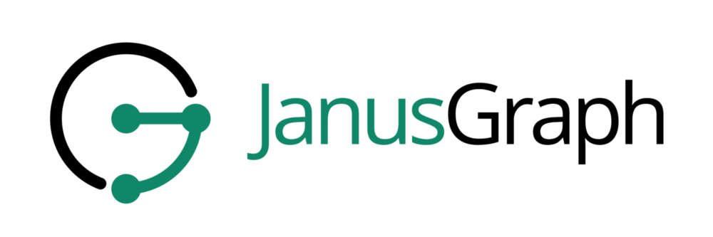

### Hi there 👋

## 👅 Languages

     
    <b>Java</b>
     
    <b>Python</b>
     
    <b>Go</b>
     
    <b>Haskell</b>
     
    <b>C#</b>
    
    <b>JavaScript</b>

## 🖴 Data Bases

     
    <b>JanusGraph</b>
     
    <b>Cassandra</b>
     
    <b>Neo4j</b>
     
    <b>PostgreSQL</b>
     
    <b>Redis</b>
     
    <b>Oracle</b>
     
    <b>SQLite</b>

## ✏️ ORM

     
    <b>Hibernate</b>
     
    <b>Sql Alchemy</b>

## 📡 Backend

     
    <b>Quarkus</b>
     
    <b>Spring</b>
     
    <b>Flask</b>

## 👀 Frontend

     
    <b>Flutter</b>
     
    <b>React Native</b>

## 🎨 Design

     
    <b>Figma</b>

## ⎈ DevOps

     
    <b>Docker</b>
     
    <b>Kubernetes</b>

## 🧬 Data Science

     
    <b>Pytorch</b>
     
    <b>Numpy</b>
     
    <b>Pandas</b>
     
    <b>Scikit-learn</b>
     
    <b>Dask</b>

## 📝 IDE

     
    <b>Visual Studio Code</b>
     
    <b>IntelliJ IDEA</b>
     
    <b>PyCharm</b>
     
    <b>Visual Studio</b>
     
    <b>WebStorm</b>

------------------------------------------------------------------------------

### 📊 My Stats

    

    

 

    

 

<h3 align="right"> 💜 Thanks you for reading </h3>
<!--
**Uniserg/Uniserg** is a ✨ _special_ ✨ repository because its `README.md` (this file) appears on your GitHub profile.
Here are some ideas to get you started:
- 🔭 I’m currently working on ...
- 🌱 I’m currently learning ...
- 👯 I’m looking to collaborate on ...
- 🤔 I’m looking for help with ...
- 💬 Ask me about ...
- 📫 How to reach me: ...
- 😄 Pronouns: ...
- ⚡ Fun fact: ...
-->
